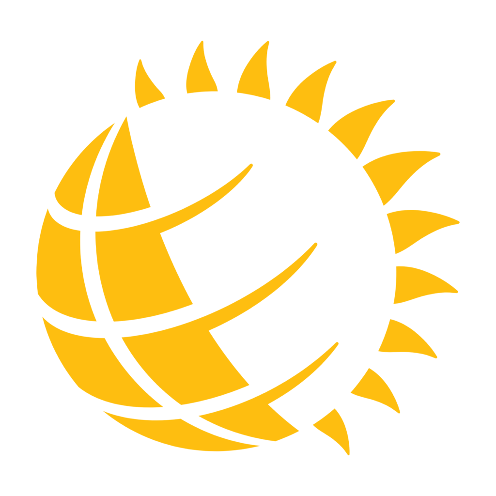
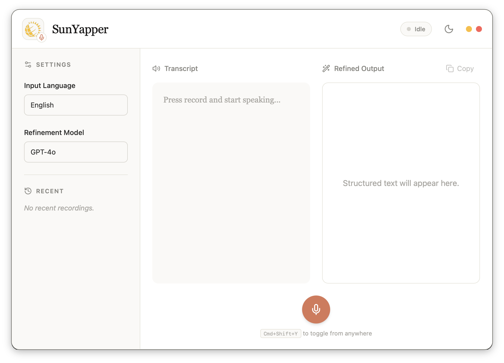
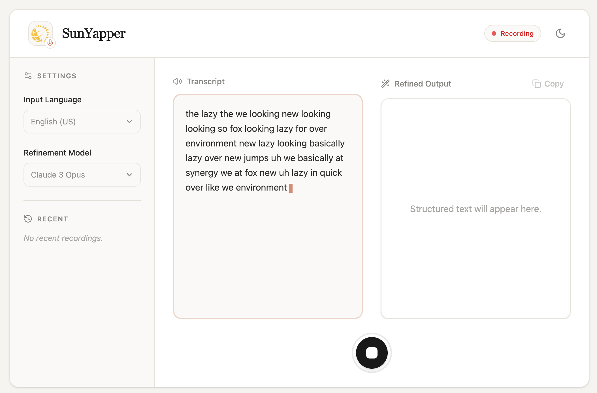
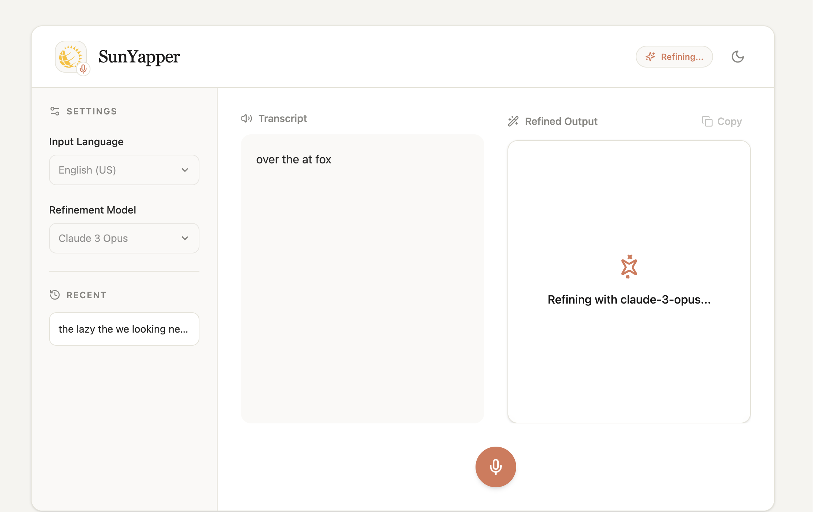

<p align="center">
  
</p>

<h1 align="center">SunYapper</h1>

<p align="center">
  <strong>Offline voice-to-text dictation with AI refinement</strong><br>
  Free &middot; Secure &middot; Enterprise-friendly &middot; Works in any app
</p>

<p align="center">
  <a href="https://github.com/karandeepbhardwaj/SunYapper/releases/latest">
    
  </a>
  <a href="https://github.com/karandeepbhardwaj/SunYapper/blob/main/LICENSE">
    
  </a>
  
</p>

---

<p align="center">
  
</p>

<p align="center">
  
  
</p>

---

## What is SunYapper?

SunYapper lets you **speak naturally and get polished English text** — in any application. It uses local speech-to-text (whisper.cpp) and GitHub Copilot for AI text refinement. No cloud STT, no API keys, no subscriptions.

**Speak in any language** — whisper translates to English automatically. Copilot cleans up grammar, filler words, and formatting.

## Download

| Platform | Download | Size | Requirements |
|----------|----------|------|--------------|
| **macOS** (Apple Silicon) | [SunYapper.dmg](https://github.com/karandeepbhardwaj/SunYapper/releases/latest) | ~140 MB | macOS 13+ |
| **Windows** (x64) | [SunYapper-setup.exe](https://github.com/karandeepbhardwaj/SunYapper/releases/latest) | ~150 MB | Windows 10+ |
| **VS Code Extension** | [sunyapper.vsix](https://github.com/karandeepbhardwaj/SunYapper/releases/latest) | ~1.5 MB | VS Code 1.95+ |

Everything is bundled inside — sox, whisper-cli, the base whisper model. No `brew install` or setup needed.

## How It Works

### Desktop App — Dictate in Any Application

1. **Install**: Open the `.dmg` (macOS) or run the `.exe` installer (Windows)
2. **Dictate**: Press `Cmd+Shift+Y` (Mac) or `Ctrl+Shift+Y` (Win) from any app
3. **Speak**: The animated sun mascot listens and shows a waveform
4. **Copy**: Click "Copy to clipboard" and paste into any app with `Cmd/Ctrl+V`

For AI text refinement, have VS Code with GitHub Copilot running in the background. SunYapper connects to it automatically via WebSocket.

### VS Code Extension — Dictate in the Editor

1. **Install**: `code --install-extension sunyapper.vsix`
2. **Download model**: Command Palette → `SunYapper: Download Whisper Model`
3. **Dictate**: `Cmd/Ctrl+Shift+Y` → speak → click "Insert at cursor"

The extension also serves as the Copilot bridge for the desktop app.

## Features

- **System-wide dictation** — works in any app (Slack, Chrome, Notes, Terminal)
- **Fully offline STT** — whisper.cpp runs locally, no cloud APIs
- **Multi-language** — select your language, whisper translates to English automatically
- **AI refinement** — Copilot removes filler words, fixes grammar, formats text
- **Animated mascot** — the sun reacts to recording, thinking, and results
- **Dark mode** — matches your system theme
- **Compact UI** — floating always-on-top panel, draggable, closeable
- **Enterprise-friendly** — no marketplace needed, share the installer directly

## Architecture

```
┌─────────────────────────────────┐         ┌────────────────────┐
│  SunYapper Desktop (Tauri v2)   │         │  VS Code + Copilot │
│                                 │◄───────►│                    │
│  sox/rec      → mic capture     │  ws://  │  CopilotBridge     │
│  whisper-cli  → offline STT     │  :19542 │  (vscode.lm API)   │
│  clipboard    → paste anywhere  │         └────────────────────┘
│  global hotkey (Cmd/Ctrl+Shift+Y)│
└─────────────────────────────────┘
              │
              ▼
       Any Application
```

| Component | Technology | Size |
|-----------|-----------|------|
| Desktop app | Tauri v2 (Rust + React) | ~8 MB |
| Audio capture | sox/rec (bundled) | ~500 KB |
| Speech-to-text | whisper-cli + libs (bundled) | ~3 MB |
| Whisper model | ggml-base.bin (bundled) | ~142 MB |
| AI refinement | VS Code Copilot (vscode.lm API) | — |

## Multi-Language Support

Select your language in the app — whisper uses its built-in translation (`-tr` flag) to output English directly. Copilot then refines the English text.

Supported: English, Spanish, French, German, Hindi, Chinese, Japanese, Korean, Portuguese, Arabic, and [90+ more](https://github.com/openai/whisper#available-models-and-languages).

## Settings

### VS Code Extension

| Setting | Default | Description |
|---------|---------|-------------|
| `sunyapper.whisperModel` | `base` | Model: tiny (~75MB), base (~142MB), small (~466MB) |
| `sunyapper.language` | `en` | Source language for speech recognition |
| `sunyapper.refinementEnabled` | `true` | Enable Copilot AI refinement |
| `sunyapper.copilotModelFamily` | `gpt-4o` | Copilot model for refinement |
| `sunyapper.insertMode` | `cursor` | Insert at cursor or replace selection |

### Desktop App

Language and model can be selected in the app footer.

## Build from Source

### Prerequisites

- **Rust** 1.70+ (`curl --proto '=https' --tlsv1.2 -sSf https://sh.rustup.rs | sh`)
- **Node.js** 18+ (`brew install node` or [nodejs.org](https://nodejs.org))
- **macOS**: `brew install sox whisper-cpp`
- **Windows**: Binary download scripts handle this automatically

### Desktop App

```bash
git clone https://github.com/karandeepbhardwaj/SunYapper.git
cd SunYapper/desktop
npm install
node scripts/bundle-sidecars.cjs    # bundles binaries + model
npx tauri build                     # .dmg (macOS) or .exe (Windows)
```

### VS Code Extension

```bash
cd SunYapper
npm install
npm run compile
npx @vscode/vsce package --no-dependencies
# → sunyapper-0.1.0.vsix
```

### Air-Gapped Build (no internet at runtime)

```bash
npm run download-binaries -- --with-model    # bundles tiny model
npm run package
```

## CI/CD

GitHub Actions automatically builds and publishes releases for macOS and Windows when a version tag is pushed:

```bash
git tag v0.3.0 && git push origin v0.3.0
```

See [`.github/workflows/release.yml`](.github/workflows/release.yml) for the workflow.

## Enterprise Use

SunYapper is designed for locked-down corporate environments:

- **Zero runtime dependencies** — binaries and model bundled in the installer
- **No marketplace needed** — share the `.dmg`, `.exe`, or `.vsix` directly
- **Fully offline STT** — whisper runs locally, audio never leaves the machine
- **Copilot-approved channel** — refinement uses your enterprise Copilot plan
- **MIT licensed** — fully open source, auditable by your security team

## Roadmap

- [x] Phase 1: VS Code extension with local STT + Copilot refinement
- [x] Phase 2: Standalone desktop app with system-wide dictation
- [ ] Phase 3: Voice-triggered actions (run tests, open terminal, execute commands)

## Contributing

1. Fork the repo
2. Create a feature branch (`git checkout -b feature/my-feature`)
3. Commit your changes
4. Push and open a Pull Request

## License

[MIT](LICENSE)
