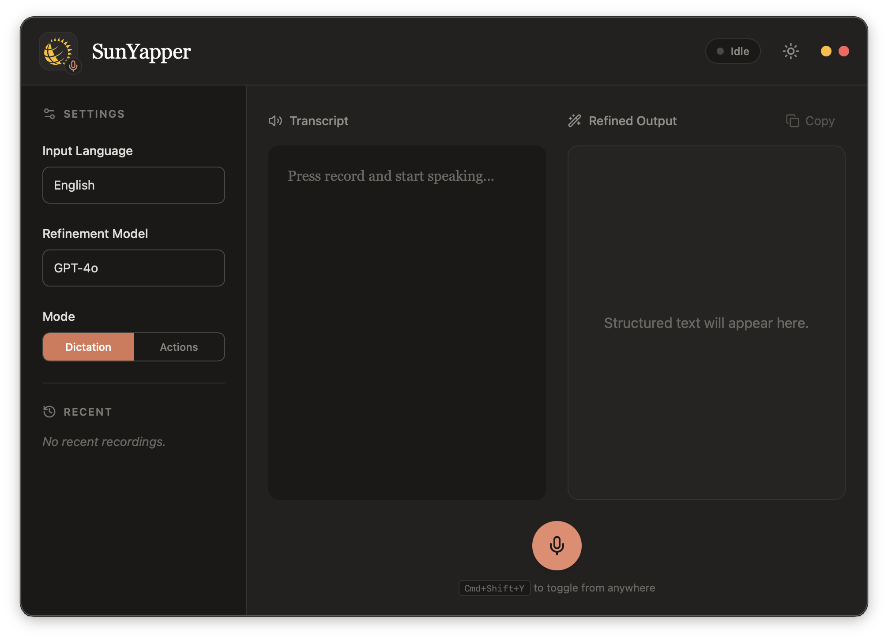

<h1 align="center">SunYapper</h1>

<p align="center">
  <strong>Voice-powered productivity: dictation, commands, and app control</strong><br>
  Free &middot; Secure &middot; Enterprise-friendly &middot; Works in any app
</p>

<p align="center">
  <a href="https://github.com/karandeepbhardwaj/SunYapper/releases/latest">
    
  </a>
  <a href="https://github.com/karandeepbhardwaj/SunYapper/blob/main/LICENSE">
    
  </a>
  
</p>

---

<p align="center">
  
</p>

---

## What is SunYapper?

SunYapper is a voice-powered productivity tool with three modes:

1. **Dictation** — Speak naturally, get polished English text. Works in any language.
2. **VS Code Actions** — Say "run tests", "open settings", "search for TODO" — executes in VS Code.
3. **App Actions** — Say "open YouTube", "check my next meeting", "create a note" — controls Chrome, Notes, Outlook.

All speech-to-text runs **locally** via whisper.cpp. AI refinement uses GitHub Copilot. No cloud STT, no API keys.

## Download

| Platform                  | Download                                                                              | Size    | What's included                               |
| ------------------------- | ------------------------------------------------------------------------------------- | ------- | --------------------------------------------- |
| **macOS** (Apple Silicon) | [SunYapper.dmg](https://github.com/karandeepbhardwaj/SunYapper/releases/latest)       | ~140 MB | Desktop app + sox + whisper + base model      |
| **Windows** (x64)         | [SunYapper-setup.exe](https://github.com/karandeepbhardwaj/SunYapper/releases/latest) | ~150 MB | Desktop app + sox + whisper + base model      |
| **VS Code Extension**     | [sunyapper.vsix](https://github.com/karandeepbhardwaj/SunYapper/releases/latest)      | ~1.5 MB | Extension (model auto-downloads on first use) |

## Three Modes

### Dictation Mode

Speak naturally → whisper transcribes → Copilot refines (removes filler words, fixes grammar, handles self-corrections).

- Multi-language: select your language, whisper translates to English automatically
- Live transcription: text appears as you speak (every 4 seconds)
- Self-correction: say "Friday 9 PM, actually 7 PM" → output is "Friday at 7 PM"

### VS Code Actions Mode

Say commands → AI classifies intent → executes in VS Code.

| Voice Command            | What Happens                                        |
| ------------------------ | --------------------------------------------------- |
| "Run tests"              | Opens terminal, runs `npm test`                     |
| "Open settings"          | Opens VS Code settings                              |
| "Search for handleClick" | Searches workspace                                  |
| "Open package.json"      | Opens the file                                      |
| "Commit my changes"      | Runs `git add -A && git commit` (with confirmation) |
| "Format document"        | Formats current file                                |
| "Toggle terminal"        | Shows/hides terminal panel                          |

Safe commands execute immediately. Destructive commands (git push, delete) require confirmation.

### App Actions Mode (Plugin System)

Say commands → local keyword matching or AI classification → controls external apps.

| Voice Command                        | App           | Action                    |
| ------------------------------------ | ------------- | ------------------------- |
| "Open YouTube"                       | Chrome        | Opens youtube.com         |
| "Search for React tutorials"         | Chrome        | Google search             |
| "Create a note saying buy groceries" | Notes/Notepad | Creates a note            |
| "What's my next meeting"             | Outlook       | Shows next calendar event |
| "What's my latest email"             | Outlook       | Shows latest email        |
| "Reply to message"                   | Outlook       | Opens reply window        |

App actions work **without VS Code** for common commands (local keyword matching). Complex commands use AI classification via Copilot.

## Plugin Architecture (MCP-Style)

Each app integration is a plugin implementing a standard `AppPlugin` trait:

```
desktop/src-tauri/src/plugins/
├── mod.rs       — Plugin trait + registry
├── chrome.rs    — Google Chrome (osascript / PowerShell)
├── notes.rs     — Apple Notes / Notepad (osascript / PowerShell)
└── outlook.rs   — Microsoft Outlook (osascript / COM)
```

**Adding a new app** = create one Rust file implementing the `AppPlugin` trait + register it in `PluginRegistry::new()`.

```rust
pub trait AppPlugin: Send + Sync {
    fn id(&self) -> &str;
    fn name(&self) -> &str;
    fn platforms(&self) -> &[&str];
    fn actions(&self) -> Vec<ActionDefinition>;
    fn execute(&self, action_id: &str, params: &serde_json::Value) -> ActionResult;
    fn is_available(&self) -> bool;
}
```

## Architecture

```
┌────────────────────────────────────┐      ┌──────────────────┐
│  SunYapper Desktop (Tauri v2)      │      │  VS Code + Copilot│
│                                    │◄────►│                  │
│  sox/rec       → mic capture       │ws:// │  CopilotBridge   │
│  whisper-cli   → offline STT       │19542 │  IntentClassifier│
│  Plugin System → app control       │      │  ActionExecutor  │
│  Global hotkey (Cmd/Ctrl+Shift+Y)  │      └──────────────────┘
│                                    │
│  Plugins:                          │
│  ├── Chrome  (osascript/PowerShell)│
│  ├── Notes   (osascript/PowerShell)│
│  └── Outlook (osascript/COM)       │
└────────────────────────────────────┘
```

## Settings

| Setting                           | Default     | Description                    |
| --------------------------------- | ----------- | ------------------------------ |
| `sunyapper.whisperModel`          | `base`      | Model: tiny, base, small       |
| `sunyapper.language`              | `en`        | Source language                |
| `sunyapper.actionMode`            | `dictation` | Mode: dictation or actions     |
| `sunyapper.actionsEnabled`        | `true`      | Enable voice-triggered actions |
| `sunyapper.actionAutoExecuteSafe` | `true`      | Auto-execute safe actions      |
| `sunyapper.refinementEnabled`     | `true`      | Enable Copilot refinement      |
| `sunyapper.copilotModelFamily`    | `gpt-4o`    | Copilot model for AI           |

## Build from Source

### Desktop App

```bash
brew install sox whisper-cpp rust    # macOS prerequisites
cd desktop
npm install
node scripts/bundle-sidecars.cjs
npx tauri build
```

### VS Code Extension

```bash
npm install --ignore-scripts
npx tsc -p ./tsconfig.json
npx @vscode/vsce package --no-dependencies
```

## Enterprise Use

- **Zero runtime dependencies** — everything bundled
- **Fully offline STT** — whisper runs locally
- **Copilot-approved channel** — uses enterprise Copilot plan
- **No marketplace needed** — share .dmg/.exe/.vsix directly
- **MIT licensed** — fully open source, auditable

## Roadmap

- [x] Phase 1: VS Code extension with local STT + Copilot refinement
- [x] Phase 2: Standalone desktop app with system-wide dictation
- [x] Phase 3: Voice-triggered VS Code/terminal actions
- [x] Phase 3b: App plugin system (Chrome, Notes, Outlook)
- [ ] Phase 4: More app plugins (Slack, Teams, Spotify, Finder)
- [ ] Phase 5: Multi-step workflows ("run tests, if pass then commit and push")

## License

[MIT](LICENSE)
